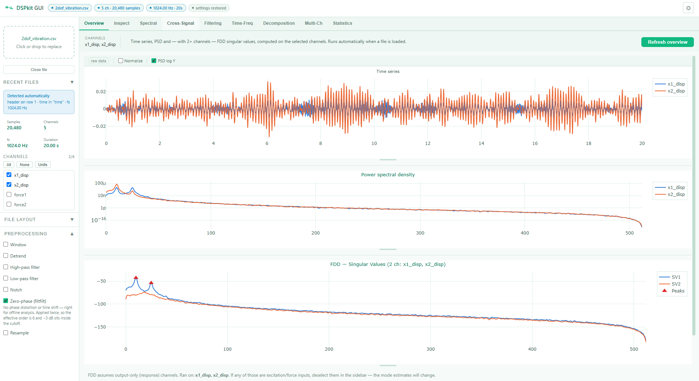
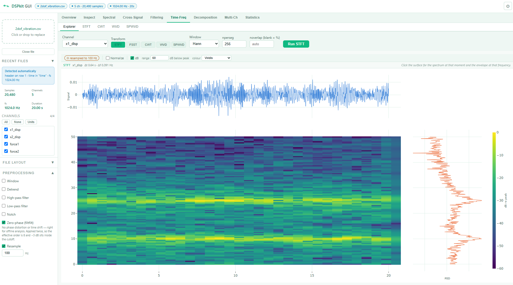
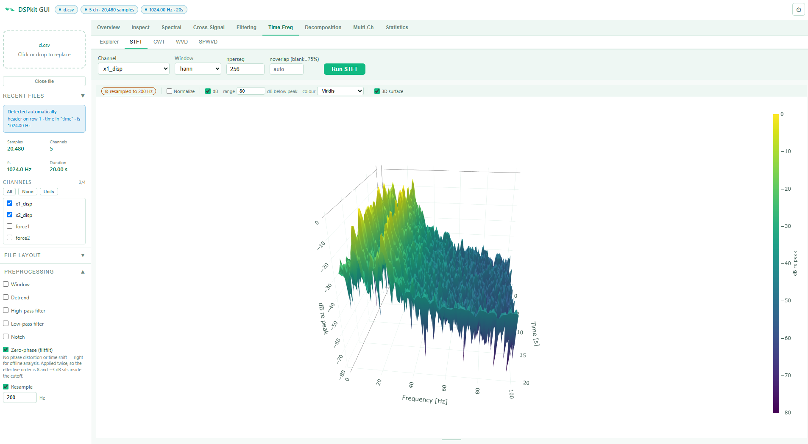

# DSPkit

[](https://doi.org/10.5281/zenodo.22257120)
[](LICENSE)
[](https://www.python.org/downloads/)

A desktop application for **exploratory signal analysis** of vibration and
structural-health-monitoring data. Drop in a CSV and start looking — no script
to write, no parameters to guess before you see anything.

Built on [DSPkit](https://github.com/LuigiCaglio/DSPkit), the signal-processing
library that does the maths.



*Load a file and this is what you get, without pressing anything.*

---

## Why

Exploratory DSP is a loop: plot it, filter it, look again, change your mind.
Doing that in a notebook means re-running cells and re-typing parameters, and
the transforms that matter most for modal work — synchrosqueezing, Wigner-Ville,
FDD — each come from a different library with a different convention.

This puts the whole loop behind one interface, on one dataset, with one set of
axes and colours, so switching between two transforms is a comparison rather
than a porting exercise.

## What it does

**Reads your file without being told how.** Delimiter, header row, metadata
preamble, whether signals run down columns or across rows, which column is time,
and the sample rate implied by it — all detected on load and shown so you can
override any of it. Then it plots straight away.

| | |
|---|---|
| **Inspect** | Time series, data table |
| **Spectral** | FFT, Welch PSD, peak detection with Q-factor, autocorrelation |
| **Cross-signal** | Cross-correlation, CSD, coherence |
| **Filtering** | High/low/band-pass, notch, detrend, zero-phase or causal — with the response drawn over the spectrum, and cutoffs pickable off the plot |
| **Time-frequency** | A linked **Explorer** over STFT, CWT, Wigner-Ville, smoothed-pseudo WVD and Fourier synchrosqueezing — click the surface to slice a spectrum or an envelope out of it |
| **Decomposition** | Hilbert instantaneous frequency, EMD, Hilbert-Huang |
| **Multi-channel** | Correlation and coherence matrices, Frequency Domain Decomposition (FDD/EFDD) for natural frequencies, mode shapes and damping |
| **Statistics** | Distributions, joint densities, covariance, Mahalanobis outliers, SHM indicators |




*The Explorer: click the surface to slice a spectrum at that instant, or an
envelope at that frequency.*



*The same surface in 3D — optional, and off by default. It shows the shape of a
ridge better than a heatmap does; the flat view is better for reading a value
off, since peaks hide what is behind them.*

Per-channel physical units carry onto every axis. Sessions resume where you left
them. Any result exports to CSV.

## Getting started

**You need Python 3.10 or newer. Nothing else** — no git, no Node, no
`pip install`. The interface ships pre-built and the analysis library ships as
a bundled wheel.

### Windows

1. **[Download the ZIP](https://github.com/LuigiCaglio/DSPkit-app/archive/refs/heads/master.zip)** and extract it anywhere.
2. Double-click **`run_dspkit_app.bat`**.
3. Wait. The first run builds its own Python environment and installs what it
   needs — a couple of minutes, once. Later runs start in seconds.
4. Your browser opens on the app. Click **load an example** to try it on the
   bundled 2-DOF dataset, or drop a CSV of your own onto the panel.

Keep the black window open while you work; closing it quits the app. Nothing is
installed system-wide — everything lives in the extracted folder, and deleting
that folder removes it completely.

If Python is missing, the launcher says so and points you at the download.
You can also drag a data file straight onto `run_dspkit_app.bat` to open the app
on that file.

### macOS / Linux

```bash
python3 -m venv venv_dspkit
venv_dspkit/bin/pip install -r backend/requirements.txt
venv_dspkit/bin/python run.py
```

### If the port is busy

DSPkit serves on `http://127.0.0.1:8000`. That port is popular — Django,
`python -m http.server` and Jupyter all want it — so if something else has it,
the app quietly moves to the next free port and tells you which. Nothing to
configure.

To pin a port yourself:

```bash
python run.py --port 8123        # or set DSPKIT_PORT=8123
```

An explicitly requested port is never silently swapped: if it is taken, you get
an error rather than a surprise.

### Your own data

CSV, TSV or TXT. You do not need to prepare it: the delimiter, header row, any
metadata preamble, whether signals run down columns or across rows, which column
holds time and the sample rate it implies are all worked out on load and shown
back to you. If any of it is wrong, **File layout** in the sidebar overrides it.

### Changing the interface (developers only)

The built frontend is committed, so this is only needed if you edit it:

```bash
cd frontend && npm install && npm run build
```

## Tests

```bash
python tests/run_all.py     # 342 assertions, no third-party packages needed
```

The library has its own suite — `pytest tests/` in the
[DSPkit](https://github.com/LuigiCaglio/DSPkit) repo, 189 passing.

## Built with

FastAPI · Svelte 5 · Plotly · NumPy/SciPy, through
[DSPkit](https://github.com/LuigiCaglio/DSPkit).

Open work is tracked in [`TODO.md`](TODO.md).

## Licence

MIT — see [LICENSE](LICENSE).
